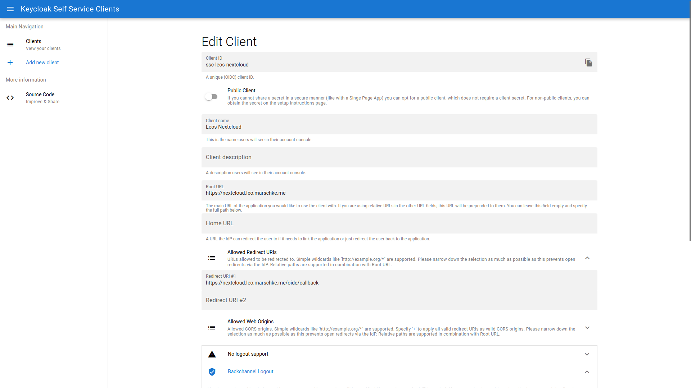

# Keycloak self-service clients

This projects allows Keycloak users to create and manage their own clients. Intentionally, users are not allowed to set all parameters but this project does take opinionated assumptions.

The goal is to provide users a way to easily attach their applications to Keycloak without going through a complicated process with e.g. the IT department.

## Components

The project consists of two main components:

* Keycloak Plugin
* Web GUI

## Features supported (API and GUI)

Methods:

* Client creation
* Client deletion
* Client listing

Client options:

* Public / Secret clients
* Set arbitrary client IDs, but all prefixed with `ssc-`
* Specifying URLs for login and logout (front- and backchannel)

All data is stored within Keycloak normal data structure, therefore the plugin and web gui is stateless.
Whether users are allowed to modify clients is specified via a client attribute (`self-service-clients-user-<user-UUID>: "manager"`).

## Development setup

Build the single components (see [their](frontend/Readme.md) [Readmes](keycloak/Readmme.md)) and then run `docker compose up` within the [testing](/testing) directory.

Create a realm `test` within Keycloak and the client `self-service-clients` with the client role `manage-self-service-clients`. Add a user with this client role.

## Production setup

This section describes how to set up both components for a production setup.

### Keycloak

* Download the [latest artifacts (main)](https://rechenknecht.net/mixxplorer/keycloak/self-service-clients/-/jobs/artifacts/main/download?job=build-keycloak-api) from the Pipeline.
* Place the `self-service-clients-XXX.jar` to your `providers` directory (`/opt/keycloak/providers` for Docker).
* Restart Keycloak.
* Create client `self-service-clients` with `manage-self-service-clients` client role for each realm you want the API to work with.
  * Public Client
  * No direct grant
  * Add as Origin the intended Web GUI origin
* Assign `manage-self-service-clients` to users as you want.

Then, the API is ready to use.

### Web frontend

* Get the latest Docker container (`dr.rechenknecht.net/mixxplorer/keycloak/self-service-clients/main/frontend:latest` or take a look at [GitLab registry](https://rechenknecht.net/mixxplorer/keycloak/self-service-clients/container_registry)). Versioned container are available as well, please check [the registry](https://rechenknecht.net/mixxplorer/keycloak/self-service-clients/container_registry).
* Run by e.g. `docker run -it --rm -p 127.0.0.1:1235:8080 -e KEYCLOAK_URL=http://127.0.0.1:8080 -e KEYCLOAK_REALM=test dr.rechenknecht.net/mixxplorer/keycloak/self-service-clients/main/frontend:latest`
* Access the frontend, everything should work.

## Acknowledgments

🔥 Initial development of this project is funded by the [Hasso-Plattner-Institute](https://hpi.de).
